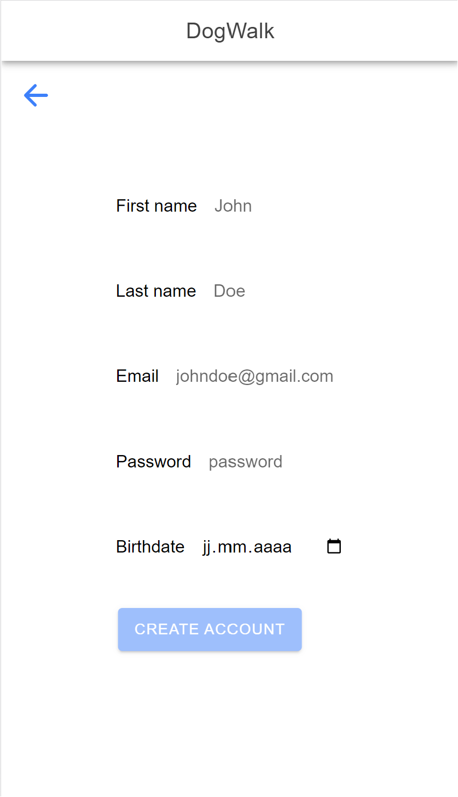
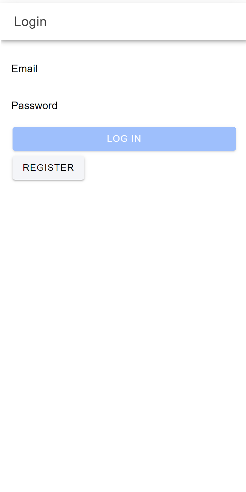
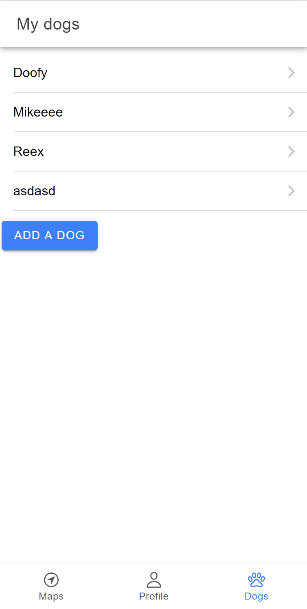
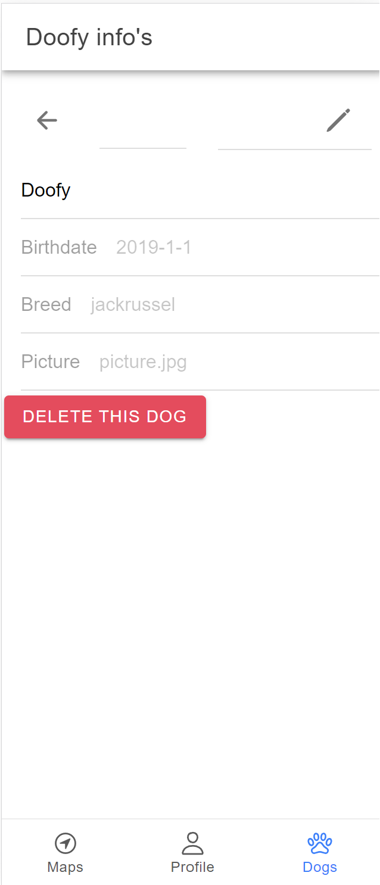
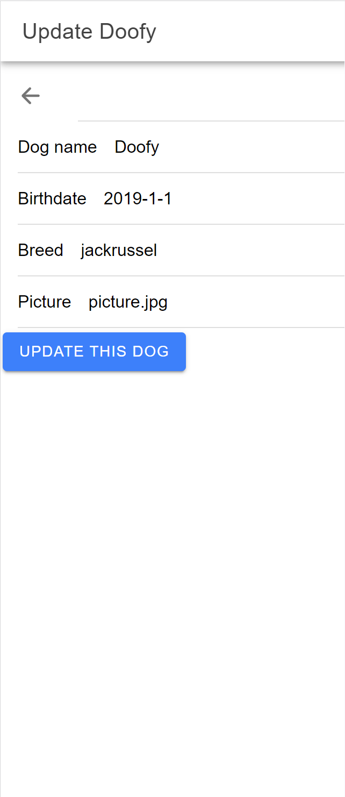
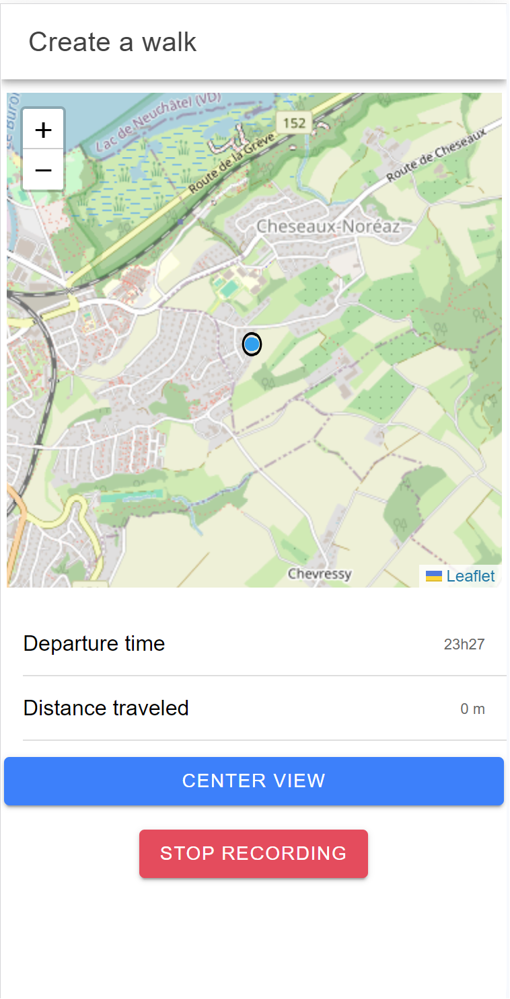
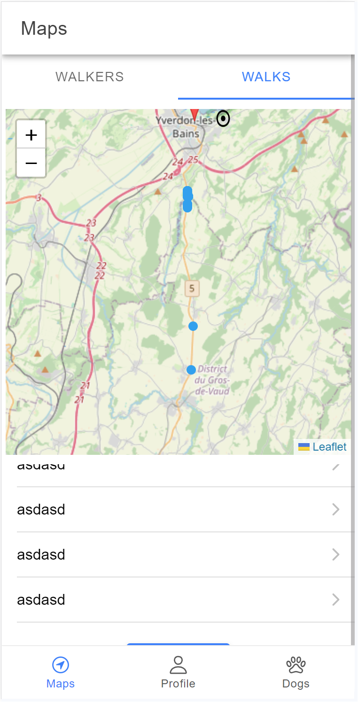
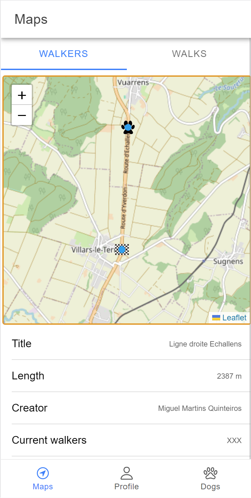
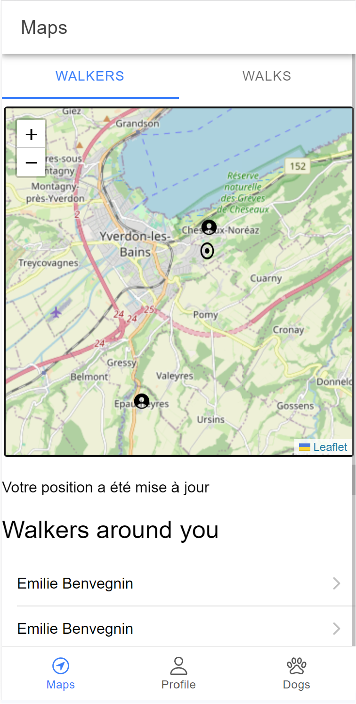
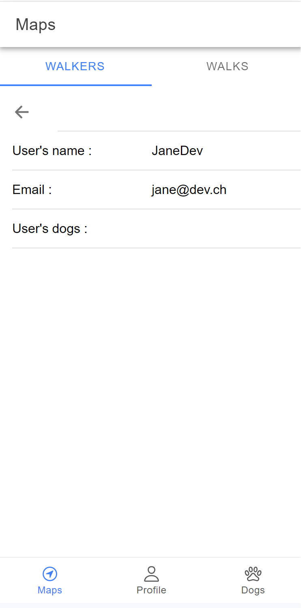

# DogWalk App

## Description

Bienvenue sur l'App DogWalk !

Cette app est un réseaux social créé pour promener votre chien avec d'autres possesseurs de chiens dans votre région. Vous pouvez créer un profil pour vous et votre chien et inviter les promeneurs à vous rejoindre. Vous pouvez également vous rejoindre sur des trajets créé par d'autres utilisateurs.

This app is built with Angular and Ionic.
Cette app a été conçue à l'aide d'Angular Ionic.

# La Team Dogwalk

Cette app a été créé par

[Tupidix](https://www.github.com/Tupidix)

[PatrickMarques24](https://www.github.com/PatrickMarques24)

[QuinteirosM](https://www.github.com/quinteirosm)

L'app est basée sur DogWalkAPI qui peut être trouvée ici:

[DogWalkAPI Repo git](https://www.github.com/Tupidix/DogWalkAPI)

[DogWalkAPI OnRender](https://dogwalkapi.onrender.com)

Avant de tester l'app, veuillez cliquer sur ce second lien et attendez jusqu'à voir le texte "Welcome to our API, please refer to the documentation to use it properly, go to /api-docs to see it". L'app est hostée sur OnRender Free et prend un petit moment à charger la première requête.

# Installation
Pour cloner l'app vous aurez besoin d'installer Git, Node.js and Ionic.
Puis d'effectuer ces commandes.

```
# Cloner le repo
$ git clone https://github.com/Tupidix/DogWalkApp.git

# Aller dans le répertoire
$ cd DogWalkApp

# Installez les dépendances
$ npm i

# Lancer le projet
$ ionic serve
```

Dans src/environments/environment.ts remplacer le contenu présent par le contenu que nous vous avons envoyé par mail.

## Fonctionnalités

### Register
Notre app permet de créer un nouvel utilisateur.



### Login
De se connecter pour accéder à l'app. Cette page et la précédente sont les 2 seules pages pouvant être accédée sans être connectée.



### Profil
De voir ses propres informations et de les modifier ainsi que se déconnecter de l'application.


### Profil chien
D'ajouter des chiens, de les modifier ainsi que de les supprimer.

  

### Créer des balades
Il est possible de créer des balades qui seront enregistrées automatiquement lors de votre parcours.



### Voir les balades
Après avoir séléctionné une balade, la carte va automatiquement se déplacer vers celle-ci et afficher sa distance réel, son point de départ et d'arrivée ainsi que son créateur.

 

### Voir les autres utilisateurs
Visionner les utilisateurs proche de vous sur la carte en tapant dessus vous pouvez voir de qui il s'agit. Seul les personnes avec une localisation enregistrée sont affichées dans la liste du bas. Les personnes se trouvant de multiples fois dans la liste sont des tests.



### Voir détail utilisateurs
En pressant sur un utilisateur on peut voir des détails sur celui-ci ainsi que sa liste de chiens.



## Bugs et fonctionnalité non-implémentée
Il est possible d'envoyer autre chose qu'un email dans register et update profile (le validator angular type="email" ne fonctionne pas). Les erreurs sont gérées mais non visible par l'utilisateur. API image non implémentée. Pas d'options de recherche ni de filtre. Join walk non-implémenté. Distance entre user et user non implémenter ni entre user et walk. Chien incompatible non implémenté. Parfois quand on séléctionne une walk l'onglet walkers est séléctionné.
