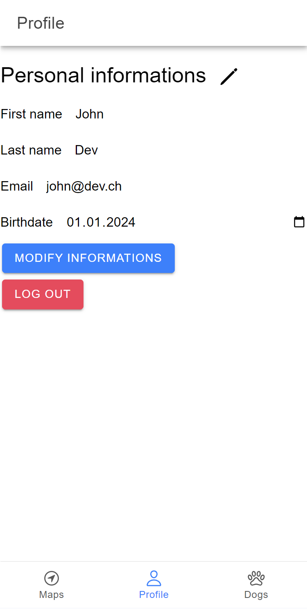

# DogWalk App

## Description

Bienvenue sur l'App DogWalk !

Cette app est un réseaux social créé pour promener votre chien avec d'autres possesseurs de chiens dans votre région. Vous pouvez créer un profil pour vous et votre chien et inviter les promeneurs à vous rejoindre. Vous pouvez également vous rejoindre sur des trajets créé par d'autres utilisateurs.

This app is built with Angular and Ionic.
Cette app a été conçue à l'aide d'Angular Ionic.

# La Team Dogwalk

Cette app a été créé par

[Tupidix](https://www.github.com/Tupidix)

[PatrickMarques24](https://www.github.com/PatrickMarques24)

[QuinteirosM](https://www.github.com/quinteirosm)

L'app est basée sur DogWalkAPI qui peut être trouvée ici:

[DogWalkAPI Repo git](https://www.github.com/Tupidix/DogWalkAPI)

[DogWalkAPI OnRender](https://dogwalkapi.onrender.com)

Avant de tester l'app, veuillez cliquer sur ce second lien et attendez jusqu'à voir le texte "Welcome to our API, please refer to the documentation to use it properly, go to /api-docs to see it". L'app est hostée sur OnRender Free et prend un petit moment à charger la première requête.

# Installation
Pour cloner l'app vous aurez besoin d'installer Git, Node.js and Ionic.
Puis d'effectuer ces commandes.

```
# Cloner le repo
$ git clone https://github.com/Tupidix/DogWalkApp.git

# Aller dans le répertoire
$ cd DogWalkApp

# Installez les dépendances
$ npm i

# Lancer le projet
$ ionic serve
```

Dans src/environments/environment.ts remplacer le contenu présent par ceci

```
// This file can be replaced during build by using the `fileReplacements` array.
// `ng build` replaces `environment.ts` with `environment.prod.ts`.
// The list of file replacements can be found in `angular.json`.

export const environment = {
  production: false,
  apiUrl: "https://dogwalkapi.onrender.com",
  qimgUrl: "https://comem-qimg.onrender.com/api",
  qimgSecret: "f0mFxxX+QnGPX6i+iLg8nB+v2wzcV9XMcbYpTmhEhcL3hwfYwjzAfDpqVdIeQJt9WzQjkV1F+Ke8ZPqDcfqIPwNrBl8DA44d+qEtSpX0OAuuxMeArCLjZWVOhZLcGtizrp0hzVbx7r869+nRPhZ+NzRy3iP3ZYX3gsxP6Zu05eE=",
};

/*
 * For easier debugging in development mode, you can import the following file
 * to ignore zone related error stack frames such as `zone.run`, `zoneDelegate.invokeTask`.
 *
 * This import should be commented out in production mode because it will have a negative impact
 * on performance if an error is thrown.
 */
// import 'zone.js/plugins/zone-error';  // Included with Angular CLI.
```

### Register
Notre app permet de créer un nouvel utilisateur.


### Login
De se connecter pour accéder à l'app. Cette page et la précédente sont les 2 seules pages pouvant être accédée sans être connectée.


### Profil
De voir ses propres informations et de les modifier ainsi que se déconnecter de l'application.



### Profil chien
D'ajouter des chiens, de les modifier ainsi que de les supprimer.

  

### Créer des balades
Il est possible de créer des balades qui seront enregistrée automatiquement lors de votre parcours.

### Voir les autres utilisateurs
Visionner les utilisateurs proche de vous sur la carte.

## Bugs et fonctionnalité non-implémentée
Il est possible d'envoyer autre chose qu'un email dans register et update profile (le validator angular type="email" ne fonctionne pas).